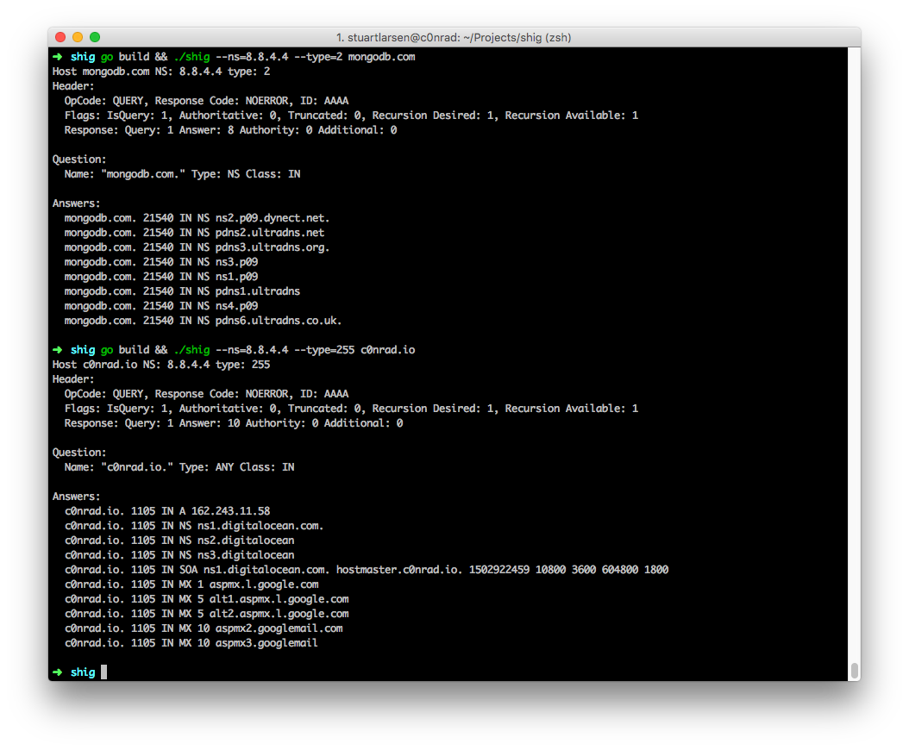

# SHIG (shitty dig)



My own for-learning-puroses dig.

Inspired by:
https://routley.io/tech/2017/12/28/hand-writing-dns-messages.html

## Usage

./shig c0nrad.io --nameserver=8.8.8.8 --type=all

## Building 

```
go build
```

## What I learned

* All DNS messages use the same format for both request and respopnse 
* DNS messages do some fun string re-use stuff where they just point to a previous instance to the string in a message
* The overall structure really only contains three unique bodies, Header, Question, Record (anwser, authority, additional).
    * Header sets flags and number of records to follow
    * Question is just what you're asking for
    * Record is the response (answer, authoirty and additional all use the same Record structure)
* There's a lot of record types https://en.wikipedia.org/wiki/List_of_DNS_record_types
* The protocol supports asking multiple questions at the same time, but no one really supports it

## Contact

c0nrad@c0nrad.io